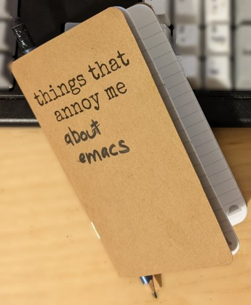

Configuration and code which fixes the things that annoy me about emacs...

I have used many, many text editors but returned to emacs after many years in the wilderness. However there are things I'm not liking. With almost any other editor you would just have to put up with it. 

Unlike many other editors emacs holds the promise that everything is customisable and configurable. So it deserves respect and web sites like this. As I work through my emacs niggles, I post solutions here so I can pull them down onto the myriad Linux machines  I use.

I will try to make this meaningful to other emacs acolytes. So you find them interesting, well that's good.
